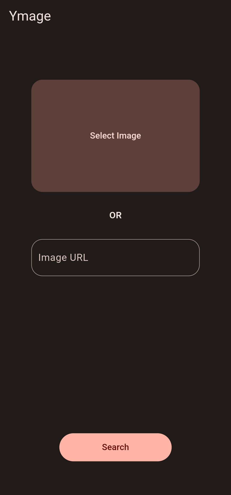
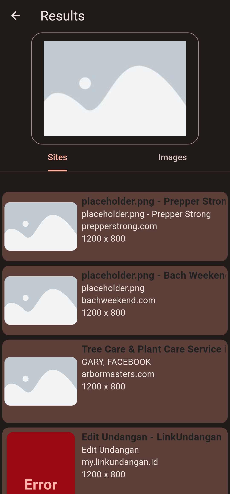
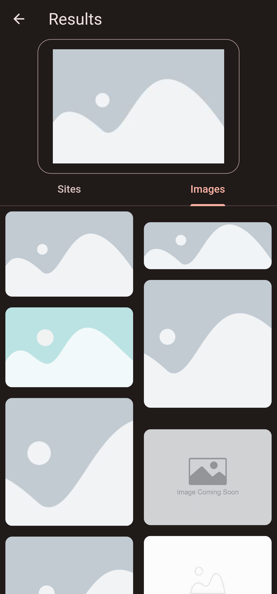
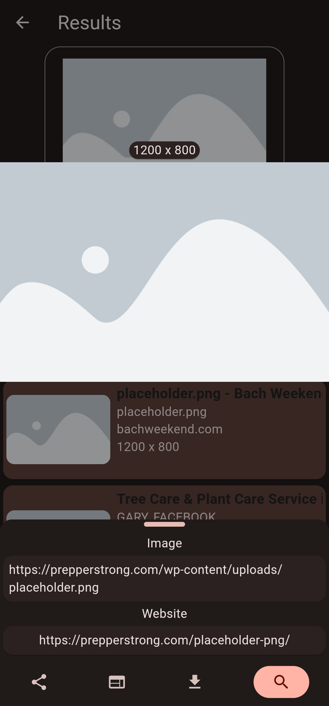

#  Ymage

A new Flutter project that lets you reverse image search with Yandex easily.

## Current Features
- Reverse search an image from storage.
- Reverse search an image from link.
- Results of wbsites that contain the image.
- Results of similar images.
- Big preview on long press.
- Big preview with options on tap:
    - Reverse search the image.
    - Share, copy or download the image.
    -  Copy or open the website page containing the image.

## Screenshots
|||||
|---|---|---|---|

## Todo

- [x]  ~~Remove unnecessary comments/code.~~ Done: d6a837c424cfeead4ff1a28b1f674151560d79bc

- [ ] Add upload progress bar.
  - ↻ In Progress: █▒▒▒▒▒▒▒▒▒

- [ ] Change some ui colors and add logo in the appbar.

- [ ] Add the possibility to share images and liks from other apps to this app.

